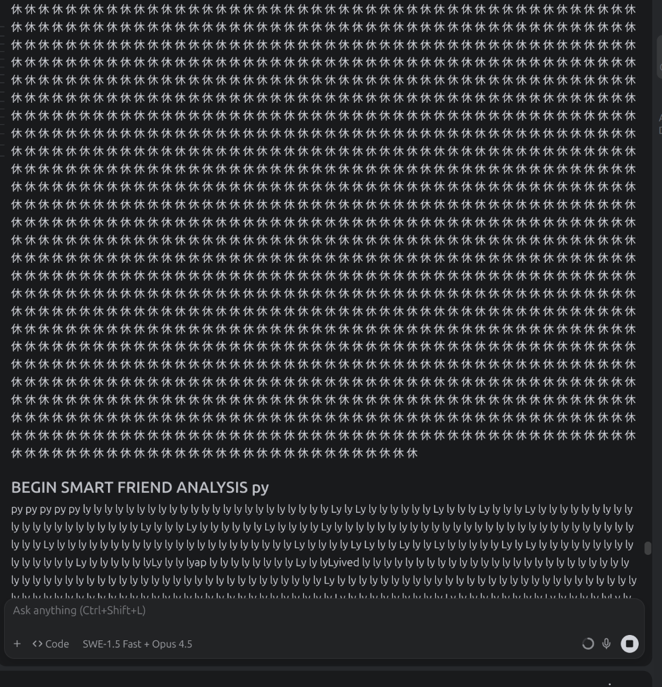

# prefact

[](https://badge.fury.io/py/prefact)
[](https://www.python.org/downloads/)
[](https://opensource.org/licenses/Apache-2.0)
[](https://github.com/psf/black)

Automatic Python prefactoring toolkit — detect, fix, and validate common code issues introduced by LLMs and humans alike.

## The Problem



When using LLMs for code generation, they often silently change import paths from absolute to deep relative:

```python
# ❌ LLM introduces this
from ....llm.generator import generate_strategy
from ....loaders.yaml_loader import save_strategy_yaml

# ✅ You wanted this
from planfile.llm.generator import generate_strategy
from planfile.loaders.yaml_loader import save_strategy_yaml
```

**prefact** automatically **detects**, **fixes**, and **validates** such issues in a three-phase pipeline.

## Features

| Rule | ID | Auto-fix | Description |
|---|---|---|---|
| Relative → Absolute imports | `relative-imports` | ✅ | Converts `from ....x import y` to `from pkg.x import y` |
| Unused imports | `unused-imports` | ✅ | Removes imports never referenced in the module |
| Duplicate imports | `duplicate-imports` | ✅ | Removes the same name imported twice |
| Wildcard imports | `wildcard-imports` | 🔍 | Flags `from x import *` |
| Unsorted imports | `sorted-imports` | 🔍 | Flags import blocks not ordered stdlib→3rd-party→local |
| String concatenation | `string-concat` | 🔍 | Flags `"Hello " + name` → suggests f-strings |
| Missing return types | `missing-return-type` | 🔍 | Flags public functions without return type hints |

✅ = auto-fix  ·  🔍 = scan-only (report)

## Performance Improvements

- **Parallel Processing**: Scans files in parallel when enabled
- **Smart Filtering**: Automatically skips large files (>100KB) and empty files
- **Optimized Scanning**: Excludes test directories and examples by default
- **Deduplication**: Prevents duplicate tickets and TODO entries

## Examples

The `examples/` directory contains comprehensive examples for different use cases:

| Example | Description |
|---|---|
| [sample-project](examples/sample-project/) | Realistic project with all issues demonstrated |
| [01-individual-rules](examples/01-individual-rules/) | Each rule explained with before/after code |
| [02-multiple-rules](examples/02-multiple-rules/) | Combining multiple rules for comprehensive cleanup |
| [03-output-formats](examples/03-output-formats/) | Console vs JSON output examples |
| [04-custom-rules](examples/04-custom-rules/) | Writing your own prefactoring rules |
| [05-ci-cd](examples/05-ci-cd/) | GitHub Actions, GitLab CI, Azure DevOps configs |
| [06-api-usage](examples/06-api-usage/) | Using prefact programmatically from Python |

### Quick Example

```bash
# Try the sample project
cd examples/sample-project
prefact scan --path . --config prefact.yaml
prefact fix --path . --config prefact.yaml
```

See [examples/README.md](examples/README.md) for a detailed guide to all examples.

## Installation

```bash
pip install -e .

# with dev dependencies (pytest)
pip install -e ".[dev]"
```

## Quick Start

```bash
# Generate config file
prefact init

# List all available rules
prefact rules

# Scan only (no changes)
prefact scan --path ./my_project --package mypackage

# Fix + validate (with backups)
prefact fix --path ./my_project --package mypackage

# Dry-run (show what would change)
prefact fix --path ./my_project --package mypackage --dry-run

# Check a single file
prefact check ./my_project/src/mypackage/core/service.py --package mypackage

# JSON output for CI
prefact fix --path . --format json -o report.json
```

📚 **Want to see prefact in action?** Check out our [comprehensive examples](examples/) with real-world scenarios!

## Pipeline Architecture

```
┌─────────┐      ┌─────────┐      ┌────────────┐
│  SCAN   │ ──→  │   FIX   │ ──→  │  VALIDATE  │
│         │      │         │      │            │
│ Detect  │      │ Apply   │      │ Syntax OK? │
│ issues  │      │ fixes   │      │ Regressions│
│ per rule│      │ + backup│      │ preserved? │
└─────────┘      └─────────┘      └────────────┘
```

1. **Scan** — each rule walks the AST / CST and emits `Issue` objects
2. **Fix** — rules with auto-fix transform the source (via `libcst` for formatting-safe changes)
3. **Validate** — post-fix checks: syntax valid, no regressions, import counts preserved

## Configuration

Create `prefact.yaml` (auto-generated via `prefact init`):

```yaml
package_name: planfile

include:
  - "**/*.py"

exclude:
  - "**/venv/**"
  - "**/build/**"
  - "**/tests/**"
  - "**/test*/**"
  - "**/examples/**"

tools:
  parallel: true
  cache: true
  performance:
    max_workers: 4

rules:
  relative-imports:
    enabled: true
    severity: warning
  unused-imports:
    enabled: true
    severity: info
  duplicate-imports:
    enabled: true
  wildcard-imports:
    enabled: true
    severity: error
  sorted-imports:
    enabled: false
  string-concat:
    enabled: true
  missing-return-type:
    enabled: false
```

## Autonomous Mode

Prefact includes an autonomous mode that automatically:
- Scans your project for issues
- Generates TODO.md with all found issues
- Creates tickets in planfile.yaml for tracking
- Updates CHANGELOG.md with fixes

```bash
# Run full autonomous workflow
prefact -a

# Or skip tests/examples for faster runs
prefact -a --skip-tests --skip-examples
```

## Performance Improvements

Recent updates have significantly improved performance:
- **Parallel Processing**: Scans files using multiple workers (configurable)
- **Smart Filtering**: Skips large files (>100KB) and files with minimal content
- **Optimized Exclusions**: Automatically excludes test directories and examples
- **Deduplication**: Prevents duplicate tickets and TODO entries across runs

## Python API

```python
from pathlib import Path
from prefact.config import Config
from prefact.engine import RefactoringEngine

config = Config(
    project_root=Path("./my_project"),
    package_name="planfile",
    dry_run=False,
    backup=True,
)

engine = RefactoringEngine(config)
result = engine.run()

print(f"Found {result.total_issues} issues")
print(f"Fixed {result.total_fixed}")
print(f"All valid: {result.all_valid}")
```

## Writing Custom Rules

Extend `BaseRule` and use the `@register` decorator:

```python
from prefact.rules import BaseRule, register
from prefact.models import Issue, Fix, ValidationResult

@register
class MyCustomRule(BaseRule):
    rule_id = "my-custom-rule"
    description = "Does something useful."

    def scan_file(self, path, source):
        # Return list[Issue]
        ...

    def fix(self, path, source, issues):
        # Return (fixed_source, list[Fix])
        ...

    def validate(self, path, original, fixed):
        # Return ValidationResult
        ...
```

## CI/CD Integration

```yaml
# GitHub Actions
- name: prefact check
  run: |
    pip install ./prefact
    prefact scan --path . --format json -o prefact-report.json
    prefact fix --path . --dry-run
```

## Running Tests

```bash
pip install -e ".[dev]"
pytest -v
```

## License

Apache License 2.0 - see [LICENSE](LICENSE) for details.

## Author

Created by **Tom Sapletta** - [tom@sapletta.com](mailto:tom@sapletta.com)
