# System Architecture Analysis

## Overview

- **Project**: /home/tom/github/semcod/prefact
- **Primary Language**: python
- **Languages**: python: 75, shell: 2, typescript: 1
- **Analysis Mode**: static
- **Total Functions**: 655
- **Total Classes**: 132
- **Modules**: 78
- **Entry Points**: 597

## Architecture by Module

### vscode-extension.src.extension
- **Functions**: 59
- **Classes**: 5
- **File**: `extension.ts`

### src.prefact.performance.cache
- **Functions**: 37
- **Classes**: 6
- **File**: `cache.py`

### src.prefact.logging
- **Functions**: 28
- **Classes**: 10
- **File**: `logging.py`

### src.prefact.rules.string_transformations
- **Functions**: 27
- **Classes**: 6
- **File**: `string_transformations.py`

### src.prefact.rules.importchecker_based
- **Functions**: 24
- **Classes**: 5
- **File**: `importchecker_based.py`

### src.prefact.rules.import_linter_based
- **Functions**: 24
- **Classes**: 5
- **File**: `import_linter_based.py`

### src.prefact.performance.parallel
- **Functions**: 23
- **Classes**: 4
- **File**: `parallel.py`

### src.prefact.rules.isort_based
- **Functions**: 23
- **Classes**: 4
- **File**: `isort_based.py`

### src.prefact.rules.autoflake_based
- **Functions**: 23
- **Classes**: 5
- **File**: `autoflake_based.py`

### src.prefact.rules.pylint_based
- **Functions**: 22
- **Classes**: 5
- **File**: `pylint_based.py`

### src.prefact.rules.unimport_based
- **Functions**: 22
- **Classes**: 5
- **File**: `unimport_based.py`

### src.prefact.rules.mypy_based
- **Functions**: 22
- **Classes**: 6
- **File**: `mypy_based.py`

### src.prefact.rules.ruff_based
- **Functions**: 19
- **Classes**: 6
- **File**: `ruff_based.py`

### src.prefact.config_extended
- **Functions**: 18
- **Classes**: 3
- **File**: `config_extended.py`

### src.prefact.git_hooks
- **Functions**: 17
- **Classes**: 2
- **File**: `git_hooks.py`

### src.prefact.plugins
- **Functions**: 17
- **Classes**: 3
- **File**: `__init__.py`

### src.prefact.rules.composite_rules
- **Functions**: 16
- **Classes**: 3
- **File**: `composite_rules.py`

### src.prefact.autonomous
- **Functions**: 15
- **Classes**: 1
- **File**: `autonomous.py`

### src.prefact.config
- **Functions**: 13
- **Classes**: 2
- **File**: `config.py`

### src.prefact.rules.registry
- **Functions**: 13
- **Classes**: 1
- **File**: `registry.py`

## Key Entry Points

Main execution flows into the system:

### src.prefact.autonomous.AutonomousRefact.scan_project
> Scan project for issues.
- **Calls**: ExtendedConfig.from_yaml, RefactoringEngine, Scanner, list, console.print, self.group_issues, None.total_seconds, console.print

### src.prefact.autonomous.AutonomousRefact.update_todo_md
> Update TODO.md with current issues, marking completed tasks.
- **Calls**: self.todo_path.exists, src.prefact.performance.cache.Cache.set, src.prefact.performance.cache.Cache.set, existing_todos.items, self.todo_path.write_text, console.print, self.todo_path.read_text, existing_content.split

### src.prefact.config_extended.ExtendedConfig.from_yaml
> Load configuration from YAML file with environment support.
- **Calls**: None.items, raw.pop, raw.pop, raw.pop, raw.pop, raw.pop, raw.pop, cls

### src.prefact.rules.registry._initialize_built_in_rules
> Initialize built-in rule mappings.
- **Calls**: src.prefact.rules.registry.get_lazy_registry, registry.register_rule_module, registry.register_rule_module, registry.register_rule_module, registry.register_rule_module, registry.register_rule_module, registry.register_rule_module, registry.register_rule_module

### examples.run_examples.main
> Run all examples and show results.
- **Calls**: console.print, examples.run_examples.find_examples, console.print, Table, table.add_column, table.add_column, table.add_column, console.print

### src.prefact.reporters.console.print_report
- **Calls**: Console, console.print, console.print, console.print, console.print, console.print, Panel, Table

### src.prefact.rules.magic_numbers.MagicNumberRule.scan_file
- **Calls**: any, ast.parse, ast.walk, re.match, isinstance, isinstance, isinstance, self._is_magic_number

### src.prefact.rules.mypy_based.MyPyHelper.check_file
> Run MyPy on a single file and return JSON results.
- **Calls**: tempfile.TemporaryDirectory, Path, str, str, config.get, config.get, subprocess.run, report_file.exists

### src.prefact.rules.composite_factory.CompositeRuleFactory.create_composite_rule
> Create a composite rule dynamically.
- **Calls**: None.__init__, self._create_strategy, self._load_tools, src.prefact.rules.registry.LazyRuleRegistry.get_all_rules, self.strategy.scan, self.strategy.fix, ValidationResult, SequentialScanStrategy

### vscode-extension.src.extension.PrefactTreeProvider.activate
- **Calls**: vscode-extension.src.extension.log, vscode-extension.src.extension.PrefactDiagnosticsProvider, vscode-extension.src.extension.PrefactTreeProvider, vscode-extension.src.extension.createTreeView, vscode-extension.src.extension.registerCommand, vscode-extension.src.extension.openTextDocument, vscode-extension.src.extension.PrefactDiagnosticsProvider.scanFile, vscode-extension.src.extension.PrefactDiagnosticsProvider.scanWorkspace

### src.prefact.rules.relative_imports.RelativeToAbsoluteImports.validate
- **Calls**: ValidationResult, ast.parse, checks.append, ast.parse, ast.walk, sum, sum, errors.append

### src.prefact.rules.unused_imports.UnusedImports.fix
- **Calls**: source.splitlines, src.prefact.performance.cache.Cache.set, ast.iter_child_nodes, ast.parse, isinstance, None.join, isinstance, enumerate

### src.prefact.rules.composite_rules.CompositeImportRules._load_tools
> Load all import-related tools.
- **Calls**: self.config.is_rule_enabled, self.config.is_rule_enabled, self.config.is_rule_enabled, self.config.is_rule_enabled, self.config.is_rule_enabled, tools.extend, tools.append, tools.append

### examples.sample-project.cli.main
> Main CLI command.
- **Calls**: click.command, click.option, click.option, print, User, print, DataProcessor, processor.add_item

### src.prefact.autonomous.AutonomousRefact.run_autonomous
> Run autonomous prefact process.
- **Calls**: console.print, Panel.fit, console.print, console.print, self.scan_project, console.print, self.update_planfile, console.print

### src.prefact.autonomous.AutonomousRefact.update_planfile
> Update planfile.yaml with new tickets.
- **Calls**: self.planfile_path.exists, src.prefact.performance.cache.Cache.set, None.extend, console.print, self.create_default_planfile, self.create_ticket_from_issue, None.append, open

### src.prefact.performance.cache.cached_file_operation
> Decorator to cache file operations.
- **Calls**: src.prefact.performance.cache.get_hash_cache, hash_cache.get_hash, src.prefact.performance.cache.get_cache, cache.get, func, cache.set, func, hash_cache.set_hash

### src.prefact.rules.importchecker_based.ImportOptimizer._extract_all_imports
> Extract all imports with their locations.
- **Calls**: source.splitlines, enumerate, line.strip, stripped.startswith, stripped.startswith, stripped.split, None.split, len

### src.prefact.rules.migration.RuleMigrationManager.create_hybrid_rule
> Create a hybrid rule that can switch between AST and Ruff.
- **Calls**: None.get, None.__init__, RuleMigrationManager, self.migration_manager.should_use_ruff, self.ast_rule.scan_file, self.migration_manager.should_use_ruff, self.ast_rule.fix, self.migration_manager.should_use_ruff

### src.prefact.autonomous.AutonomousRefact.run_examples
> Run all examples and verify they work.
- **Calls**: list, self.examples_dir.exists, console.print, self.examples_dir.rglob, console.print, Progress, progress.add_task, progress.advance

### src.prefact.plugins.PluginManager.load_plugin
> Load a plugin and register its rules.
- **Calls**: print, PluginValidator.validate_plugin_module, metadata.entry_point.split, importlib.import_module, getattr, callable, self._loaded_modules.add, print

### src.prefact.cli.autonomous_cmd
> Run autonomous prefact mode (-a).

Automatically initializes prefact.yaml if missing, runs examples,
scans for issues, and creates tickets in planfile
- **Calls**: main.command, click.option, click.option, click.option, click.option, Console, AutonomousRefact, auto.run_autonomous

### src.prefact.rules.unimport_based.UnimportUnusedImports.scan_file
- **Calls**: UnimportHelper.check_source, source.splitlines, enumerate, line.strip, stripped.startswith, item.get, import_lines.get, issues.append

### src.prefact.plugins.PluginManager._discover_local_plugins
> Discover plugins in a local directory.
- **Calls**: plugin_dir.glob, PluginValidator.validate_plugin_path, importlib.util.spec_from_file_location, importlib.util.module_from_spec, spec.loader.exec_module, PluginMetadata, plugins.append, print

### src.prefact.performance.cache.cached_result
> Decorator to cache function results.
- **Calls**: src.prefact.performance.cache.get_cache, cache.get, func, cache.set, func, key_func, None.hexdigest, None.hexdigest

### src.prefact.rules.importchecker_based.ImportCheckerUnusedImports._find_import_lines
> Find line numbers for each import.
- **Calls**: source.splitlines, enumerate, line.strip, stripped.startswith, stripped.startswith, stripped.split, None.split, len

### src.prefact.rules.unimport_based.UnimportAll.validate
- **Calls**: UnimportUnusedImports, unused_rule.validate, all_checks.extend, all_errors.extend, UnimportDuplicateImports, duplicate_rule.validate, all_checks.extend, all_errors.extend

### src.prefact.rules.autoflake_based.AutoflakeAll.validate
- **Calls**: AutoflakeUnusedImports, unused_rule.validate, all_checks.extend, all_errors.extend, AutoflakeUnusedVariables, var_rule.validate, all_checks.extend, all_errors.extend

### src.prefact.config.Config.from_yaml
> Load configuration from a YAML file.
- **Calls**: cls._parse_rules, cls._get_default_patterns, cls, yaml.safe_load, raw.pop, path.read_text, Path, raw.pop

### vscode-extension.src.extension.PrefactTreeProvider.getChildren
- **Calls**: vscode-extension.src.extension.has, vscode-extension.src.extension.set, vscode-extension.src.extension.get, vscode-extension.src.extension.push, vscode-extension.src.extension.from, vscode-extension.src.extension.PrefactDiagnosticsProvider.entries, vscode-extension.src.extension.map, vscode-extension.src.extension.PrefactTreeItem

## Process Flows

Key execution flows identified:

### Flow 1: scan_project
```
scan_project [src.prefact.autonomous.AutonomousRefact]
```

### Flow 2: update_todo_md
```
update_todo_md [src.prefact.autonomous.AutonomousRefact]
  └─ →> set
  └─ →> set
```

### Flow 3: from_yaml
```
from_yaml [src.prefact.config_extended.ExtendedConfig]
```

### Flow 4: _initialize_built_in_rules
```
_initialize_built_in_rules [src.prefact.rules.registry]
  └─> get_lazy_registry
```

### Flow 5: main
```
main [examples.run_examples]
  └─> find_examples
```

### Flow 6: print_report
```
print_report [src.prefact.reporters.console]
```

### Flow 7: scan_file
```
scan_file [src.prefact.rules.magic_numbers.MagicNumberRule]
```

### Flow 8: check_file
```
check_file [src.prefact.rules.mypy_based.MyPyHelper]
```

### Flow 9: create_composite_rule
```
create_composite_rule [src.prefact.rules.composite_factory.CompositeRuleFactory]
  └─ →> get_all_rules
```

### Flow 10: activate
```
activate [vscode-extension.src.extension.PrefactTreeProvider]
```

## Key Classes

### vscode-extension.src.extension.PrefactDiagnosticsProvider
- **Methods**: 32
- **Key Methods**: vscode-extension.src.extension.PrefactDiagnosticsProvider.scanFile, vscode-extension.src.extension.PrefactDiagnosticsProvider.config, vscode-extension.src.extension.PrefactDiagnosticsProvider.result, vscode-extension.src.extension.PrefactDiagnosticsProvider.scanWorkspace, vscode-extension.src.extension.PrefactDiagnosticsProvider.workspaceFolders, vscode-extension.src.extension.PrefactDiagnosticsProvider.config, vscode-extension.src.extension.PrefactDiagnosticsProvider.result, vscode-extension.src.extension.PrefactDiagnosticsProvider.fixFile, vscode-extension.src.extension.PrefactDiagnosticsProvider.document, vscode-extension.src.extension.PrefactDiagnosticsProvider.fixWorkspace

### vscode-extension.src.extension.PrefactTreeProvider
- **Methods**: 26
- **Key Methods**: vscode-extension.src.extension.PrefactTreeProvider.refresh, vscode-extension.src.extension.PrefactTreeProvider.getTreeItem, vscode-extension.src.extension.PrefactTreeProvider.getChildren, vscode-extension.src.extension.PrefactTreeProvider.issuesByFile, vscode-extension.src.extension.PrefactTreeProvider.file, vscode-extension.src.extension.PrefactTreeProvider.item, vscode-extension.src.extension.PrefactTreeProvider.fileIssues, vscode-extension.src.extension.PrefactTreeProvider.item, vscode-extension.src.extension.PrefactTreeProvider.activate, vscode-extension.src.extension.PrefactTreeProvider.diagnosticsProvider

### src.prefact.autonomous.AutonomousRefact
> Autonomous prefact manager.
- **Methods**: 15
- **Key Methods**: src.prefact.autonomous.AutonomousRefact.__init__, src.prefact.autonomous.AutonomousRefact.run_autonomous, src.prefact.autonomous.AutonomousRefact.create_refact_config, src.prefact.autonomous.AutonomousRefact.detect_project_info, src.prefact.autonomous.AutonomousRefact.run_examples, src.prefact.autonomous.AutonomousRefact.scan_project, src.prefact.autonomous.AutonomousRefact.group_issues, src.prefact.autonomous.AutonomousRefact.update_planfile, src.prefact.autonomous.AutonomousRefact.create_default_planfile, src.prefact.autonomous.AutonomousRefact.create_ticket_from_issue

### src.prefact.logging.PprefactLogger
> Structured logger for prefact with enterprise features.
- **Methods**: 15
- **Key Methods**: src.prefact.logging.PprefactLogger.__init__, src.prefact.logging.PprefactLogger._setup_handlers, src.prefact.logging.PprefactLogger.debug, src.prefact.logging.PprefactLogger.info, src.prefact.logging.PprefactLogger.warning, src.prefact.logging.PprefactLogger.error, src.prefact.logging.PprefactLogger.critical, src.prefact.logging.PprefactLogger._log, src.prefact.logging.PprefactLogger._send_telemetry, src.prefact.logging.PprefactLogger.add_telemetry_callback

### src.prefact.config.Config
> Top-level configuration.
- **Methods**: 13
- **Key Methods**: src.prefact.config.Config.from_yaml, src.prefact.config.Config._parse_rules, src.prefact.config.Config._get_default_patterns, src.prefact.config.Config.rule_enabled, src.prefact.config.Config.is_rule_enabled, src.prefact.config.Config.rule_options, src.prefact.config.Config.get_rule_option, src.prefact.config.Config.set_rule_option, src.prefact.config.Config.detect_package_name, src.prefact.config.Config._detect_from_pyproject

### src.prefact.git_hooks.GitHooks
> Manages Git hooks for prefact.
- **Methods**: 11
- **Key Methods**: src.prefact.git_hooks.GitHooks.__init__, src.prefact.git_hooks.GitHooks._find_git_dir, src.prefact.git_hooks.GitHooks.install_hooks, src.prefact.git_hooks.GitHooks._install_hook, src.prefact.git_hooks.GitHooks._generate_hook_script, src.prefact.git_hooks.GitHooks._pre_commit_hook, src.prefact.git_hooks.GitHooks._pre_push_hook, src.prefact.git_hooks.GitHooks._commit_msg_hook, src.prefact.git_hooks.GitHooks.uninstall_hooks, src.prefact.git_hooks.GitHooks.list_hooks

### src.prefact.plugins.PluginManager
> Manages loading and registration of plugins.
- **Methods**: 11
- **Key Methods**: src.prefact.plugins.PluginManager.__init__, src.prefact.plugins.PluginManager.discover_plugins, src.prefact.plugins.PluginManager._discover_entry_point_plugins, src.prefact.plugins.PluginManager._discover_local_plugins, src.prefact.plugins.PluginManager.load_plugin, src.prefact.plugins.PluginManager.load_all_plugins, src.prefact.plugins.PluginManager.get_rule, src.prefact.plugins.PluginManager._load_plugin_for_rule, src.prefact.plugins.PluginManager.list_plugins, src.prefact.plugins.PluginManager._is_rule_from_plugin

### src.prefact.rules.llm_generated_code.LLMGeneratedCodeRule
> Detect code that appears to be LLM-generated.
- **Methods**: 9
- **Key Methods**: src.prefact.rules.llm_generated_code.LLMGeneratedCodeRule.__init__, src.prefact.rules.llm_generated_code.LLMGeneratedCodeRule._load_indicators, src.prefact.rules.llm_generated_code.LLMGeneratedCodeRule.scan_file, src.prefact.rules.llm_generated_code.LLMGeneratedCodeRule._check_comment_ratio, src.prefact.rules.llm_generated_code.LLMGeneratedCodeRule._check_docstring_patterns, src.prefact.rules.llm_generated_code.LLMGeneratedCodeRule._has_llm_docstring_pattern, src.prefact.rules.llm_generated_code.LLMGeneratedCodeRule._map_severity, src.prefact.rules.llm_generated_code.LLMGeneratedCodeRule.fix, src.prefact.rules.llm_generated_code.LLMGeneratedCodeRule.validate
- **Inherits**: BaseRule

### src.prefact.rules.llm_hallucinations.LLMHallucinationRule
> Detect LLM hallucination patterns in code.
- **Methods**: 9
- **Key Methods**: src.prefact.rules.llm_hallucinations.LLMHallucinationRule.__init__, src.prefact.rules.llm_hallucinations.LLMHallucinationRule._load_patterns, src.prefact.rules.llm_hallucinations.LLMHallucinationRule.scan_file, src.prefact.rules.llm_hallucinations.LLMHallucinationRule._check_ast_patterns, src.prefact.rules.llm_hallucinations.LLMHallucinationRule._is_suspicious_function_name, src.prefact.rules.llm_hallucinations.LLMHallucinationRule._is_suspicious_import, src.prefact.rules.llm_hallucinations.LLMHallucinationRule._map_severity, src.prefact.rules.llm_hallucinations.LLMHallucinationRule.fix, src.prefact.rules.llm_hallucinations.LLMHallucinationRule.validate
- **Inherits**: BaseRule

### src.prefact.rules.registry.LazyRuleRegistry
> Registry that lazily loads rule classes.
- **Methods**: 8
- **Key Methods**: src.prefact.rules.registry.LazyRuleRegistry.__init__, src.prefact.rules.registry.LazyRuleRegistry.get_rule, src.prefact.rules.registry.LazyRuleRegistry._load_module, src.prefact.rules.registry.LazyRuleRegistry._find_rule_class, src.prefact.rules.registry.LazyRuleRegistry.get_all_rules, src.prefact.rules.registry.LazyRuleRegistry.list_available_rules, src.prefact.rules.registry.LazyRuleRegistry.register_rule, src.prefact.rules.registry.LazyRuleRegistry.register_rule_module

### src.prefact.rules.string_transformations.ContextAwareStringTransformer
> Transform string concatenations with context awareness.
- **Methods**: 8
- **Key Methods**: src.prefact.rules.string_transformations.ContextAwareStringTransformer.__init__, src.prefact.rules.string_transformations.ContextAwareStringTransformer.visit_FunctionDef, src.prefact.rules.string_transformations.ContextAwareStringTransformer.leave_FunctionDef, src.prefact.rules.string_transformations.ContextAwareStringTransformer.visit_ClassDef, src.prefact.rules.string_transformations.ContextAwareStringTransformer.leave_ClassDef, src.prefact.rules.string_transformations.ContextAwareStringTransformer.leave_BinaryOperation, src.prefact.rules.string_transformations.ContextAwareStringTransformer._should_skip_context, src.prefact.rules.string_transformations.ContextAwareStringTransformer._is_in_logging_statement
- **Inherits**: cst.CSTTransformer

### src.prefact.performance.parallel.ParallelEngine
> Parallel processing engine for prefact.
- **Methods**: 7
- **Key Methods**: src.prefact.performance.parallel.ParallelEngine.__init__, src.prefact.performance.parallel.ParallelEngine.scan_files, src.prefact.performance.parallel.ParallelEngine._scan_with_thread_pool, src.prefact.performance.parallel.ParallelEngine._scan_with_process_pool, src.prefact.performance.parallel.ParallelEngine._execute_task_wrapper, src.prefact.performance.parallel.ParallelEngine._get_enabled_rule_ids, src.prefact.performance.parallel.ParallelEngine.fix_files

### src.prefact.performance.cache.Cache
> Wrapper for diskcache with additional functionality.
- **Methods**: 7
- **Key Methods**: src.prefact.performance.cache.Cache.__init__, src.prefact.performance.cache.Cache.get, src.prefact.performance.cache.Cache.set, src.prefact.performance.cache.Cache.delete, src.prefact.performance.cache.Cache.clear, src.prefact.performance.cache.Cache.get_stats, src.prefact.performance.cache.Cache.close

### src.prefact.config_extended.ExtendedConfig
> Extended configuration with additional features.
- **Methods**: 7
- **Key Methods**: src.prefact.config_extended.ExtendedConfig.__init__, src.prefact.config_extended.ExtendedConfig.from_yaml, src.prefact.config_extended.ExtendedConfig._deep_merge, src.prefact.config_extended.ExtendedConfig.get_tool_config, src.prefact.config_extended.ExtendedConfig.get_performance_setting, src.prefact.config_extended.ExtendedConfig.get_plugin_config, src.prefact.config_extended.ExtendedConfig.to_dict
- **Inherits**: Config

### src.prefact.rules.importchecker_based.ImportDependencyAnalysis
> Analyze import dependencies using importchecker.
- **Methods**: 7
- **Key Methods**: src.prefact.rules.importchecker_based.ImportDependencyAnalysis.__init__, src.prefact.rules.importchecker_based.ImportDependencyAnalysis._load_checker_config, src.prefact.rules.importchecker_based.ImportDependencyAnalysis.scan_file, src.prefact.rules.importchecker_based.ImportDependencyAnalysis._extract_imports, src.prefact.rules.importchecker_based.ImportDependencyAnalysis._detect_circular_imports, src.prefact.rules.importchecker_based.ImportDependencyAnalysis.fix, src.prefact.rules.importchecker_based.ImportDependencyAnalysis.validate
- **Inherits**: BaseRule

### src.prefact.rules.pylint_based.PylintComprehensive
> Comprehensive analysis using Pylint with custom rules.
- **Methods**: 7
- **Key Methods**: src.prefact.rules.pylint_based.PylintComprehensive.__init__, src.prefact.rules.pylint_based.PylintComprehensive._load_pylint_config, src.prefact.rules.pylint_based.PylintComprehensive.scan_file, src.prefact.rules.pylint_based.PylintComprehensive._map_pylint_to_prefact, src.prefact.rules.pylint_based.PylintComprehensive._map_pylint_severity, src.prefact.rules.pylint_based.PylintComprehensive.fix, src.prefact.rules.pylint_based.PylintComprehensive.validate
- **Inherits**: BaseRule

### src.prefact.rules.isort_based.ISortHelper
> Helper class for ISort operations.
- **Methods**: 7
- **Key Methods**: src.prefact.rules.isort_based.ISortHelper.check_file, src.prefact.rules.isort_based.ISortHelper.check_source, src.prefact.rules.isort_based.ISortHelper._find_import_blocks, src.prefact.rules.isort_based.ISortHelper._is_block_sorted, src.prefact.rules.isort_based.ISortHelper._needs_section_separators, src.prefact.rules.isort_based.ISortHelper.fix_file, src.prefact.rules.isort_based.ISortHelper.fix_source

### src.prefact.rules.isort_based.CustomImportOrganization
> Organize imports according to custom rules.
- **Methods**: 7
- **Key Methods**: src.prefact.rules.isort_based.CustomImportOrganization.__init__, src.prefact.rules.isort_based.CustomImportOrganization._load_custom_rules, src.prefact.rules.isort_based.CustomImportOrganization.scan_file, src.prefact.rules.isort_based.CustomImportOrganization._check_grouping, src.prefact.rules.isort_based.CustomImportOrganization._check_alphabetical, src.prefact.rules.isort_based.CustomImportOrganization.fix, src.prefact.rules.isort_based.CustomImportOrganization.validate
- **Inherits**: BaseRule

### src.prefact.rules.string_transformations.StringConcatTransformer
> Transform string concatenations to f-strings.
- **Methods**: 7
- **Key Methods**: src.prefact.rules.string_transformations.StringConcatTransformer.__init__, src.prefact.rules.string_transformations.StringConcatTransformer._get_line_number, src.prefact.rules.string_transformations.StringConcatTransformer.leave_BinaryOperation, src.prefact.rules.string_transformations.StringConcatTransformer._collect_string_parts, src.prefact.rules.string_transformations.StringConcatTransformer._eval_string, src.prefact.rules.string_transformations.StringConcatTransformer._should_transform, src.prefact.rules.string_transformations.StringConcatTransformer._create_fstring
- **Inherits**: cst.CSTTransformer

### src.prefact.performance.parallel.PerformanceMonitor
> Monitor performance of parallel operations.
- **Methods**: 6
- **Key Methods**: src.prefact.performance.parallel.PerformanceMonitor.__init__, src.prefact.performance.parallel.PerformanceMonitor.start_timing, src.prefact.performance.parallel.PerformanceMonitor.end_timing, src.prefact.performance.parallel.PerformanceMonitor.record_cache_hit, src.prefact.performance.parallel.PerformanceMonitor.record_cache_miss, src.prefact.performance.parallel.PerformanceMonitor.get_stats

## Data Transformation Functions

Key functions that process and transform data:

### src.prefact.validator.Validator.validate_file
- **Output to**: self._rules.get, results.append, rule.validate

### src.prefact.config.Config._parse_rules
> Parse rules configuration from YAML.
- **Output to**: rules_raw.items, isinstance, RuleConfig, isinstance, RuleConfig

### src.prefact.plugins.PluginValidator.validate_plugin_module
> Validate that a plugin module is safe to load.
- **Output to**: hasattr, hasattr, isinstance, issubclass

### src.prefact.plugins.PluginValidator.validate_plugin_path
> Validate plugin file path is safe.
- **Output to**: plugin_path.resolve, plugin_path.name.startswith

### src.prefact.performance.parallel.ParallelEngine._scan_with_process_pool
> Scan using process pool (for large batches).
- **Output to**: vscode-extension.src.extension.PrefactDiagnosticsProvider.range, len, ProcessPoolExecutor, as_completed, executor.submit

### src.prefact.performance.cache.ScanResultCache.invalidate_file
> Invalidate all cache entries for a file.

### src.prefact.rules.magic_numbers.MagicNumberRule.validate
- **Output to**: self.scan_file, ValidationResult, len, len

### src.prefact.config_extended.ConfigValidator.validate
> Validate configuration and return list of errors.
- **Output to**: config.tools.items, errors.extend, config.rules.items, ConfigValidator._validate_performance_config, errors.extend

### src.prefact.config_extended.ConfigValidator._validate_ruff_config
> Validate Ruff configuration.
- **Output to**: errors.append, isinstance, errors.append, isinstance

### src.prefact.config_extended.ConfigValidator._validate_mypy_config
> Validate MyPy configuration.
- **Output to**: isinstance, errors.append

### src.prefact.config_extended.ConfigValidator._validate_isort_config
> Validate ISort configuration.
- **Output to**: errors.append

### src.prefact.config_extended.ConfigValidator._validate_performance_config
> Validate performance configuration.
- **Output to**: errors.append, errors.append, isinstance, isinstance

### src.prefact.config_extended.ConfigValidator._validate_rule_config
> Validate individual rule configuration.
- **Output to**: errors.append, isinstance, all, isinstance, errors.append

### src.prefact.rules.unused_imports._process_assignment_for_all
> Process assignment to __all__ and add exported names to used set.
- **Output to**: isinstance, isinstance, isinstance, isinstance, used.add

### src.prefact.rules.unused_imports.UnusedImports.validate
- **Output to**: ValidationResult, ast.parse, checks.append, errors.append

### src.prefact.rules.ruff_based.RuffWildcardImports.validate
- **Output to**: ValidationResult

### src.prefact.rules.ruff_based.RuffPrintStatements.validate
- **Output to**: ValidationResult

### src.prefact.rules.ruff_based.RuffUnusedImports.validate
- **Output to**: RuffHelper.check_file, ValidationResult, len, len

### src.prefact.rules.ruff_based.RuffSortedImports.validate
- **Output to**: RuffHelper.check_file, ValidationResult, len

### src.prefact.rules.ruff_based.RuffDuplicateImports.validate
- **Output to**: ValidationResult

### src.prefact.rules.importchecker_based.ImportCheckerUnusedImports.validate
- **Output to**: ImportCheckerHelper.check_file, ValidationResult, len, len

### src.prefact.rules.importchecker_based.ImportCheckerDuplicateImports.validate
- **Output to**: self.scan_file, ValidationResult, len, len

### src.prefact.rules.importchecker_based.ImportDependencyAnalysis.validate
- **Output to**: self.scan_file, ValidationResult, len

### src.prefact.rules.importchecker_based.ImportOptimizer.validate
- **Output to**: ValidationResult

### src.prefact.rules.type_hints.MissingReturnType.validate
- **Output to**: ValidationResult

## Behavioral Patterns

### recursion__flatten_add
- **Type**: recursion
- **Confidence**: 0.90
- **Functions**: src.prefact.rules.string_concat._flatten_add

### recursion__module_to_str
- **Type**: recursion
- **Confidence**: 0.90
- **Functions**: src.prefact.rules.relative_imports._module_to_str

### state_machine_CacheContext
- **Type**: state_machine
- **Confidence**: 0.70
- **Functions**: src.prefact.performance.cache.CacheContext.__init__, src.prefact.performance.cache.CacheContext.__enter__, src.prefact.performance.cache.CacheContext.__exit__

### state_machine_RuffPrintStatements
- **Type**: state_machine
- **Confidence**: 0.70
- **Functions**: src.prefact.rules.ruff_based.RuffPrintStatements.scan_file, src.prefact.rules.ruff_based.RuffPrintStatements._should_ignore_file, src.prefact.rules.ruff_based.RuffPrintStatements.fix, src.prefact.rules.ruff_based.RuffPrintStatements.validate

### state_machine_PylintPrintStatements
- **Type**: state_machine
- **Confidence**: 0.70
- **Functions**: src.prefact.rules.pylint_based.PylintPrintStatements.__init__, src.prefact.rules.pylint_based.PylintPrintStatements._load_pylint_config, src.prefact.rules.pylint_based.PylintPrintStatements.scan_file, src.prefact.rules.pylint_based.PylintPrintStatements.fix, src.prefact.rules.pylint_based.PylintPrintStatements.validate

### state_machine_LogContext
- **Type**: state_machine
- **Confidence**: 0.70
- **Functions**: src.prefact.logging.LogContext.__init__, src.prefact.logging.LogContext.__enter__, src.prefact.logging.LogContext.__exit__, src.prefact.logging.LogContext.log

### state_machine_PrintStatements
- **Type**: state_machine
- **Confidence**: 0.70
- **Functions**: src.prefact.rules.print_statements.PrintStatements.scan_file, src.prefact.rules.print_statements.PrintStatements.fix, src.prefact.rules.print_statements.PrintStatements.validate

## Public API Surface

Functions exposed as public API (no underscore prefix):

- `src.prefact.autonomous.AutonomousRefact.scan_project` - 57 calls
- `src.prefact.autonomous.AutonomousRefact.update_todo_md` - 36 calls
- `src.prefact.config_extended.ExtendedConfig.from_yaml` - 31 calls
- `examples.06-api-usage.example.run_prefact_example` - 28 calls
- `examples.run_examples.main` - 25 calls
- `src.prefact.reporters.console.print_report` - 24 calls
- `src.prefact.rules.magic_numbers.MagicNumberRule.scan_file` - 22 calls
- `src.prefact.rules.mypy_based.MyPyHelper.check_file` - 21 calls
- `src.prefact.rules.composite_factory.CompositeRuleFactory.create_composite_rule` - 20 calls
- `src.prefact.rules.benchmark.benchmark_file` - 20 calls
- `vscode-extension.src.extension.PrefactTreeProvider.activate` - 20 calls
- `src.prefact.rules.relative_imports.RelativeToAbsoluteImports.validate` - 20 calls
- `src.prefact.rules.unused_imports.UnusedImports.fix` - 19 calls
- `examples.06-api-usage.example.batch_processing_example` - 19 calls
- `examples.sample-project.cli.main` - 18 calls
- `src.prefact.autonomous.AutonomousRefact.run_autonomous` - 16 calls
- `src.prefact.autonomous.AutonomousRefact.update_planfile` - 16 calls
- `src.prefact.performance.cache.cached_file_operation` - 16 calls
- `src.prefact.rules.benchmark.print_benchmark_results` - 16 calls
- `src.prefact.rules.migration.RuleMigrationManager.create_hybrid_rule` - 16 calls
- `examples.06-api-usage.example.custom_rule_example` - 16 calls
- `src.prefact.autonomous.AutonomousRefact.run_examples` - 15 calls
- `src.prefact.plugins.PluginManager.load_plugin` - 15 calls
- `src.prefact.cli.autonomous_cmd` - 15 calls
- `src.prefact.rules.unimport_based.UnimportUnusedImports.scan_file` - 15 calls
- `src.prefact.performance.cache.cached_result` - 14 calls
- `src.prefact.rules.unimport_based.UnimportAll.validate` - 14 calls
- `src.prefact.rules.autoflake_based.AutoflakeAll.validate` - 14 calls
- `src.prefact.config.Config.from_yaml` - 13 calls
- `vscode-extension.src.extension.PrefactTreeProvider.getChildren` - 13 calls
- `src.prefact.git_hooks.main` - 12 calls
- `src.prefact.autonomous.AutonomousRefact.update_changelog_md` - 12 calls
- `src.prefact.config_extended.ConfigValidator.validate` - 12 calls
- `src.prefact.rules.import_linter_based.ImportLinterNoRelative.scan_file` - 12 calls
- `src.prefact.rules.llm_generated_code.LLMGeneratedCodeRule.scan_file` - 12 calls
- `src.prefact.rules.benchmark.main` - 12 calls
- `src.prefact.rules.string_transformations.StringConcatToFString.validate` - 12 calls
- `src.prefact.git_hooks.PreCommitConfig.install` - 11 calls
- `src.prefact.autonomous.AutonomousRefact.group_issues` - 11 calls
- `src.prefact.autonomous.AutonomousRefact.run_tests` - 11 calls

## System Interactions

How components interact:

```mermaid
graph TD
    scan_project --> from_yaml
    scan_project --> RefactoringEngine
    scan_project --> Scanner
    scan_project --> list
    scan_project --> print
    update_todo_md --> exists
    update_todo_md --> set
    update_todo_md --> items
    update_todo_md --> write_text
    from_yaml --> items
    from_yaml --> pop
    _initialize_built_in --> get_lazy_registry
    _initialize_built_in --> register_rule_module
    main --> print
    main --> find_examples
    main --> Table
    main --> add_column
    print_report --> Console
    print_report --> print
    scan_file --> any
    scan_file --> parse
    scan_file --> walk
    scan_file --> match
    scan_file --> isinstance
    check_file --> TemporaryDirectory
    check_file --> Path
    check_file --> str
    check_file --> get
    create_composite_rul --> __init__
    create_composite_rul --> _create_strategy
```



## Reverse Engineering Guidelines

1. **Entry Points**: Start analysis from the entry points listed above
2. **Core Logic**: Focus on classes with many methods
3. **Data Flow**: Follow data transformation functions
4. **Process Flows**: Use the flow diagrams for execution paths
5. **API Surface**: Public API functions reveal the interface

## Context for LLM

Maintain the identified architectural patterns and public API surface when suggesting changes.